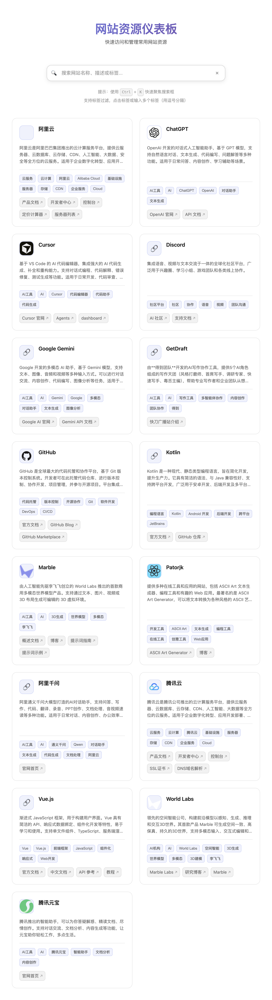

# 仪表板

一个简洁美观的工具和平台站点汇总仪表板，帮助快速访问常用的在线资源。

**注意**：本应用完全通过 API 获取数据，需要配合 `site-dashboard-server` 使用。

[点击体验](https://site-dashboard.zhifu.tech/)

## 功能特性

- 🔍 **智能搜索**：支持全文搜索和标签过滤，使用防抖优化性能
- 🏷️ **标签系统**：点击标签快速筛选，支持多标签叠加过滤（AND 逻辑）
- 🔗 **核心链接**：每个网站卡片可添加多个相关链接，方便快速访问
- 🎯 **Favicon 图标**：自动使用站点的 favicon 作为图标，加载失败时显示默认图标
- 📱 **响应式设计**：完美适配桌面端和移动端，使用 CSS Grid 自适应布局
- 🌓 **暗黑模式**：自动适配系统主题，使用 CSS 变量实现主题切换
- ⚡ **快速访问**：快捷键支持（Ctrl/Cmd + K 聚焦搜索框，Esc 清空搜索）
- 🎨 **精美卡片**：现代化的卡片式布局，支持悬停效果和动画过渡
- ♿ **无障碍支持**：完整的 ARIA 标签和键盘导航支持
- 🏗️ **模块化架构**：ES6+ 模块化设计，清晰的目录结构，易于维护和扩展

## 截屏展示



仪表板提供了简洁美观的界面，支持智能搜索、标签过滤、快速访问等功能。

## 使用方法

### 搜索站点

1. **全文搜索**：在搜索框中输入关键词，支持站点名称、描述、标签的全文搜索
2. **标签过滤**：点击站点卡片上的标签，快速筛选相关站点
3. **多标签过滤**：在搜索框中输入多个标签（用逗号分隔），例如：`AI工具, 对话助手`
   - 支持使用 `#` 前缀标识标签，例如：`#AI工具, #对话助手`
   - 多个标签使用 AND 逻辑（所有标签都必须匹配）
4. **快捷键**：
   - `Ctrl/Cmd + K`：聚焦搜索框并选中内容
   - `Esc`：清空搜索并失焦

### 添加新站点

站点数据由 `site-dashboard-server` 管理，通过 API 提供。添加新站点需要通过 API：

**使用 API 添加站点：**

```bash
curl -X POST http://localhost:3002/api/sites \
  -H "Content-Type: application/json" \
  -d '{
    "name": "新站点",
    "url": "https://example.com/",
    "icon": "https://example.com/favicon.ico",
    "description": "站点描述",
    "links": [
      {
        "text": "相关链接1",
        "url": "https://example.com/link1"
      }
    ],
    "tags": ["标签1", "标签2"]
  }'
```

**注意**：`icon` 字段应使用站点的 favicon URL，格式为 `https://{域名}/favicon.ico`。如果 favicon 加载失败，会自动显示默认图标。

**注意**：应用完全通过 API 获取数据，不再使用本地文件。所有站点数据由 `site-dashboard-server` 管理。

## 技术栈

- **HTML5**：语义化标签，完整的无障碍支持
- **CSS3**：CSS 变量系统，响应式设计，暗黑模式支持
- **JavaScript ES6+**：类模块化架构，防抖/节流优化，异步数据加载
- **REST API**：通过 API 从服务器获取站点数据
- **site-dashboard-server**：后端 API 服务器，管理站点数据

## 架构设计

### 模块化架构

应用采用 ES6+ 模块化设计，代码结构清晰，职责分明：

#### 核心模块（`js/core/`）
- **`DataLoader.js`**：负责数据加载，处理 JSON 请求和错误处理
- **`SearchManager.js`**：负责搜索查询解析和匹配逻辑
- **`Renderer.js`**：负责 UI 渲染，包括卡片、状态显示等

#### 应用层（`js/app/`）
- **`Dashboard.js`**：主应用类，协调各个模块，管理应用状态

#### 工具函数（`js/utils/`）
- **`debounce.js`**：防抖和节流工具函数

#### 入口文件
- **`js/main.js`**：应用入口，初始化 Dashboard 实例

### 性能优化

- **防抖处理**：搜索输入使用 300ms 防抖，减少不必要的渲染
- **事件委托**：标签点击使用事件委托，提高性能
- **异步加载**：使用 `fetch` API 异步加载数据，不阻塞 UI
- **CSS 变量**：使用 CSS 变量实现主题切换，性能优异

### 用户体验

- **加载状态**：清晰的加载动画和状态提示
- **错误处理**：友好的错误提示和重试机制
- **空状态**：搜索无结果时提供 Google 搜索建议
- **键盘导航**：完整的键盘快捷键支持

## 文件结构

```text
site-dashboard/
├── index.html              # 主页面（语义化 HTML5，包含 API 配置）
├── styles.css              # 样式文件（CSS 变量，响应式设计）
├── README.md              # 说明文档
├── js/                    # JavaScript 模块目录
│   ├── main.js            # 应用入口文件
│   ├── utils/             # 工具函数模块
│   │   └── debounce.js    # 防抖和节流工具函数
│   ├── core/              # 核心功能模块
│   │   ├── DataLoader.js  # 数据加载器（从 API 获取数据）
│   │   ├── SearchManager.js # 搜索管理器
│   │   └── Renderer.js    # 渲染器
│   ├── app/               # 应用层模块
│   │   └── Dashboard.js   # Dashboard 主应用类
│   └── config/            # 配置文件
│       ├── config.js      # 应用配置（API 地址等）
│       └── api.js         # API 配置工具
```

### 目录说明

- **`js/utils/`**：通用工具函数，可复用的辅助方法
- **`js/core/`**：核心业务逻辑，独立的功能模块
- **`js/app/`**：应用层代码，协调各模块的交互
- **`js/config/`**：配置文件，如 API 配置
- **`js/main.js`**：应用入口，负责初始化

## 浏览器支持

- Chrome/Edge（推荐）
- Firefox
- Safari
- 移动端浏览器

**注意**：使用 ES6 模块 (`import/export`)，需要支持 ES6 模块的现代浏览器。如果需要在旧浏览器运行，需要使用构建工具（如 Webpack、Vite、Rollup）打包。

## 开发指南

### 开发环境设置

#### 1. 安装依赖

```bash
npm install
```

#### 2. 代码检查

```bash
# 检查代码规范
npm run lint

# 自动修复代码规范问题
npm run lint:fix
```

#### 3. 代码格式化

```bash
# 格式化代码
npm run format

# 检查代码格式
npm run format:check
```

#### 4. 配置 API 地址

应用需要通过 API 获取数据，推荐在配置文件中设置：

**方法 1: 使用配置文件（推荐）**

修改 `js/config/config.js`：

```javascript
export const config = {
  apiBaseUrl: 'http://localhost:3002/api', // 开发环境
  // apiBaseUrl: 'https://api.example.com/api', // 生产环境
};
```

**方法 2: HTML 中配置**

在 `index.html` 中设置：

```html
<script data-api-base="http://localhost:3002/api" src="js/main.js" type="module"></script>
```

**方法 3: 全局变量**

在 HTML 中设置全局变量：

```html
<script>
  window.SITE_DASHBOARD_API_BASE = 'http://localhost:3002/api';
</script>
<script src="js/main.js" type="module"></script>
```

**重要**：
- 开发环境：使用 `http://localhost:3002/api`
- 生产环境：修改为实际的 API 服务器地址
- 确保 `site-dashboard-server` 已启动并运行
- **配置文件方式最灵活，推荐使用**

#### 5. 本地开发

由于项目使用 ES6 模块，需要本地服务器运行：

**方法 1: 使用 Docker（推荐）**

```bash
# 启动 Docker 容器（本地调试模式）
./scripts/site-dashboard.sh docker-up

# 访问 http://localhost:8082
# 默认端口 8082，可通过环境变量 PORT 修改
PORT=8081 ./scripts/site-dashboard.sh docker-up

# 查看日志
./scripts/site-dashboard.sh docker-logs

# 停止容器
./scripts/site-dashboard.sh docker-down
```

**方法 2: 使用本地服务器**

```bash
# 使用 Python
python -m http.server 8000

# 或使用 Node.js
npx serve .

# 或使用 VS Code Live Server 扩展
```

访问 `http://localhost:8000`

**重要提示**：
- ✅ 应用完全通过 API 获取数据，不再使用本地文件
- ✅ 所有站点数据由 `site-dashboard-server` 管理
- ✅ 添加或修改站点需要通过 API 进行操作
- ⚠️ 确保 API 服务器正常运行，否则应用无法加载数据
- ⚠️ 必须在 `index.html` 中配置正确的 API 地址

### 代码规范

#### 1. 命名规范

- **类名**：使用 PascalCase，如 `Dashboard`, `DataLoader`, `SearchManager`
- **函数/方法名**：使用 camelCase，如 `loadSites`, `handleSearch`
- **变量名**：使用 camelCase，如 `sites`, `filteredSites`, `elements`
- **常量**：使用 UPPER_SNAKE_CASE，如 `SERVER_HOST`, `APP_DIR`
- **文件名**：
  - JavaScript 类文件：PascalCase，如 `Dashboard.js`
  - 工具函数文件：camelCase，如 `debounce.js`
  - CSS 文件：kebab-case，如 `styles.css`
  - 配置文件：kebab-case，如 `site-dashboard.nginx.conf`

#### 2. 文件组织

- **模块化**：每个文件一个主要功能
- **职责单一**：每个类/函数只做一件事
- **依赖清晰**：明确模块间的依赖关系
- **目录结构**：
  - `js/utils/`：通用工具函数
  - `js/core/`：核心业务逻辑模块
  - `js/app/`：应用层代码

#### 3. 注释规范

使用 JSDoc 格式注释，为所有公共方法添加注释：

```javascript
/**
 * 加载所有网站数据
 * @returns {Promise<Array>} 网站数据数组
 */
async loadSites() {
  // ...
}
```

#### 4. 类型定义

使用 JSDoc 类型定义：

```javascript
/**
 * 匹配网站数据
 * @param {Object} site - 网站数据对象
 * @param {string} searchTerm - 搜索词
 * @param {Array<string>} tags - 标签数组
 * @returns {boolean} 是否匹配
 */
matchSite(site, searchTerm, tags) {
  // ...
}
```

### 添加新功能

#### 1. 添加新站点

站点数据通过 API 管理，使用 `site-dashboard-server` 的 API 添加新站点：

```yaml
name: 站点名称
url: https://example.com/
icon: https://example.com/favicon.ico
description: 站点描述
links:
  - text: 相关链接1
    url: https://example.com/link1
tags:
  - 标签1
  - 标签2
```

**注意**：
- `icon` 字段应使用站点的 favicon URL，格式为 `https://{域名}/favicon.ico`
- 如果 favicon 加载失败，会自动显示默认图标 🔗
- 应用完全通过 API 获取数据，不再使用本地文件

**数据获取机制**：
- **完全通过 API**：所有站点数据从 `site-dashboard-server` API 获取
- **实时更新**：数据由服务器端管理，更新即时生效
- **无需构建**：不需要生成索引文件或任何构建步骤

**添加新站点**：
通过 `site-dashboard-server` 的 API 添加新站点（参考 `site-dashboard-server` 的 API 文档），刷新前端页面即可看到新站点。

#### 2. 创建新模块

1. 在 `js/core/` 或 `js/utils/` 目录创建新文件
2. 使用 JSDoc 添加类型注释
3. 导出类或函数
4. 在 `js/app/Dashboard.js` 中集成

示例：

```javascript
// js/core/NewModule.js
/**
 * 新模块
 * @module core/NewModule
 */
export class NewModule {
  constructor() {
    // 初始化
  }
  
  /**
   * 执行操作
   * @param {string} param - 参数
   * @returns {Promise<void>}
   */
  async doSomething(param) {
    // 实现
  }
}
```

#### 3. 添加新工具函数

在 `js/utils/` 目录创建新文件或添加到现有文件：

```javascript
// js/utils/helpers.js
/**
 * 格式化日期
 * @param {Date} date - 日期对象
 * @returns {string} 格式化后的日期字符串
 */
export function formatDate(date) {
  // 实现
}
```

### 性能优化

#### 1. 防抖和节流

使用 `debounce()` 和 `throttle()` 优化频繁操作：

```javascript
import { debounce } from "../utils/debounce.js";

const debouncedSearch = debounce((e) => {
  this.handleSearch(e.target.value);
}, 300);
```

#### 2. DOM 操作优化

- 使用事件委托处理动态添加的元素
- 批量更新 DOM，减少重排重绘
- 使用 `transform` 和 `opacity` 实现动画（GPU 加速）

#### 3. 数据加载优化

- 使用 `fetch` API 异步加载数据
- 实现错误处理和重试机制
- 合理使用缓存策略

### 测试

#### 手动测试清单

- [ ] 搜索功能正常（全文搜索、标签过滤）
- [ ] 标签点击功能正常
- [ ] 快捷键功能正常（Ctrl/Cmd + K, Esc）
- [ ] 响应式设计正常（桌面端、移动端）
- [ ] 数据加载功能正常
- [ ] 错误处理正常（网络错误、数据格式错误）
- [ ] 空状态显示正常

#### 浏览器兼容性测试

- Chrome/Edge（推荐）
- Firefox
- Safari
- 移动端浏览器（iOS Safari、Chrome Mobile）

### 部署

#### 使用 Docker 部署（推荐）

**📖 详细部署指南请参考：[Docker 部署指南](docs/DOCKER_DEPLOYMENT.md)**

**⚠️ 多应用部署：** 如果同一台服务器部署多个应用，请参考 [多应用部署指南](docs/MULTI_APP_DEPLOYMENT.md)

快速部署命令：

```bash
# 构建 Docker 镜像
./scripts/site-dashboard.sh docker-build

# 部署到服务器（自动构建、上传、运行）
./scripts/site-dashboard.sh docker-deploy

# 本地调试（开发模式，支持热重载）
./scripts/site-dashboard.sh docker-up

# 查看容器日志
./scripts/site-dashboard.sh docker-logs

# 进入容器 shell
./scripts/site-dashboard.sh docker-shell

# 重启容器
./scripts/site-dashboard.sh docker-restart

# 停止容器
./scripts/site-dashboard.sh docker-down
```

#### 使用传统部署脚本

```bash
# 部署前端应用
./scripts/site-dashboard.sh deploy

# 更新 Nginx 配置
./scripts/site-dashboard.sh update-nginx

# 检查部署状态
./scripts/site-dashboard.sh check
```

#### 手动部署

1. 确保所有代码已格式化：`npm run format`
2. 运行代码检查：`npm run lint`
3. 测试所有功能
4. 上传文件到服务器
5. 配置 Nginx（参考 `scripts/site-dashboard.nginx.conf`）

#### Docker 部署说明

**Docker 部署的优势：**
- 环境一致性：开发、测试、生产环境完全一致
- 快速部署：一键构建、上传、运行
- 易于回滚：可以快速切换到之前的版本
- 资源隔离：容器化部署，不影响主机环境

**Docker 本地调试：**
- 支持热重载：修改代码后自动生效（通过 volume 挂载）
- 端口映射：默认映射到 8080 端口
- 健康检查：自动检查容器健康状态
- 日志查看：实时查看容器日志
- **注意**：需要确保 `site-dashboard-server` API 服务器可访问（默认 `http://localhost:3002/api`）

**Docker 生产部署：**
- 自动构建镜像
- 压缩镜像并上传到服务器
- 在服务器上加载镜像并运行容器
- 自动配置重启策略
- **注意**：部署前需要修改 `index.html` 中的 API 地址为生产环境地址

### 常见问题

#### 1. 模块导入错误

确保使用正确的路径和文件扩展名：

```javascript
import { DataLoader } from "../core/DataLoader.js"; // ✅
import { DataLoader } from "../core/DataLoader";     // ❌
```

#### 2. CORS 错误

确保使用本地服务器运行，不能直接打开 HTML 文件（`file://` 协议）。

#### 3. 数据加载失败

- **检查 API 服务器**：确保 `site-dashboard-server` 已启动并运行在正确的端口
- **检查 API 配置**：确认 `index.html` 中的 `data-api-base` 属性配置正确
- **检查网络连接**：打开浏览器开发者工具，查看网络请求是否成功
- **检查 CORS**：如果 API 服务器在不同域名，检查 CORS 配置
- **查看控制台**：检查浏览器控制台的错误信息
- **测试 API**：使用 curl 或 Postman 测试 API 端点是否正常
  ```bash
  curl http://localhost:3002/api/health
  curl http://localhost:3002/api/sites
  ```

#### 4. 搜索功能不工作

- 检查搜索输入框的 ID 是否正确（`searchInput`）
- 检查事件监听器是否正确绑定
- 检查控制台是否有错误信息

#### 5. Docker 相关问题

**镜像拉取失败（网络问题）：**

如果遇到 `failed to resolve source metadata` 错误，可能是网络问题。解决方案：

1. **配置 Docker 镜像加速器**（推荐）：
   
   在 Docker Desktop 设置中添加镜像加速器：
   - 阿里云：`https://registry.cn-hangzhou.aliyuncs.com`
   - 腾讯云：`https://mirror.ccs.tencentyun.com`
   - 网易：`https://hub-mirror.c.163.com`

2. **手动拉取镜像**：
   ```bash
   docker pull nginx:1.25-alpine
   ```

3. **使用代理**：
   ```bash
   export HTTP_PROXY=http://your-proxy:port
   export HTTPS_PROXY=http://your-proxy:port
   docker build -t site-dashboard:latest .
   ```

**容器无法启动：**
- 检查端口是否被占用：`lsof -i :8082`
- 检查 Docker 是否运行：`docker ps`
- 查看容器日志：`./scripts/site-dashboard.sh docker-logs`

**镜像构建失败：**
- 检查 Dockerfile 是否存在
- 检查文件权限是否正确
- 查看构建日志：`docker build -t site-dashboard:latest .`
- 确保网络连接正常，可以访问 Docker Hub

**容器内文件未更新：**
- 确保使用 `docker-up` 命令（开发模式，支持热重载）
- 检查 volume 挂载是否正确
- 重启容器：`./scripts/site-dashboard.sh docker-restart`

### 生产环境建议

1. 确保所有代码已格式化：`npm run format`
2. 运行代码检查：`npm run lint`
3. 测试所有功能
4. 检查浏览器兼容性
5. 优化资源加载（压缩 CSS、JS）
6. 配置适当的缓存策略（参考 Nginx 配置）

#### 构建优化（可选）

如果需要进一步优化，可以考虑：

- 使用 Vite/Webpack 打包
- 代码压缩和混淆
- 资源优化（图片、字体）
- 代码分割和懒加载

## 许可证

MIT License
